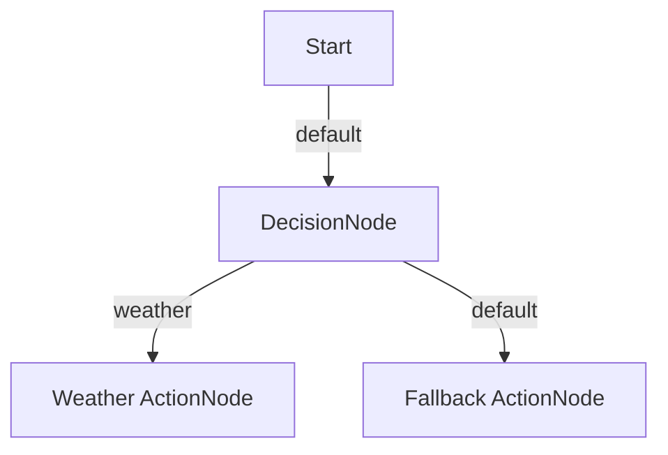
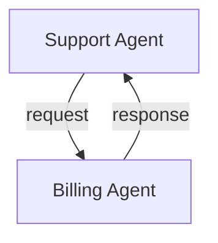
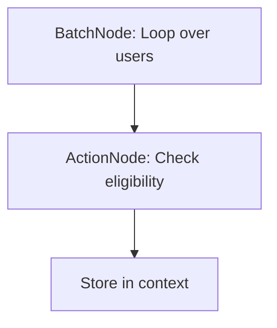
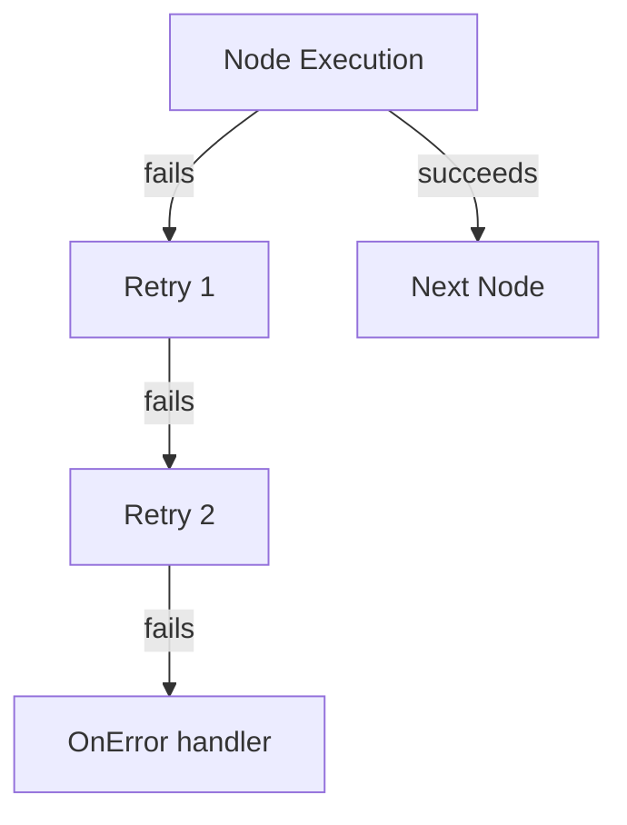
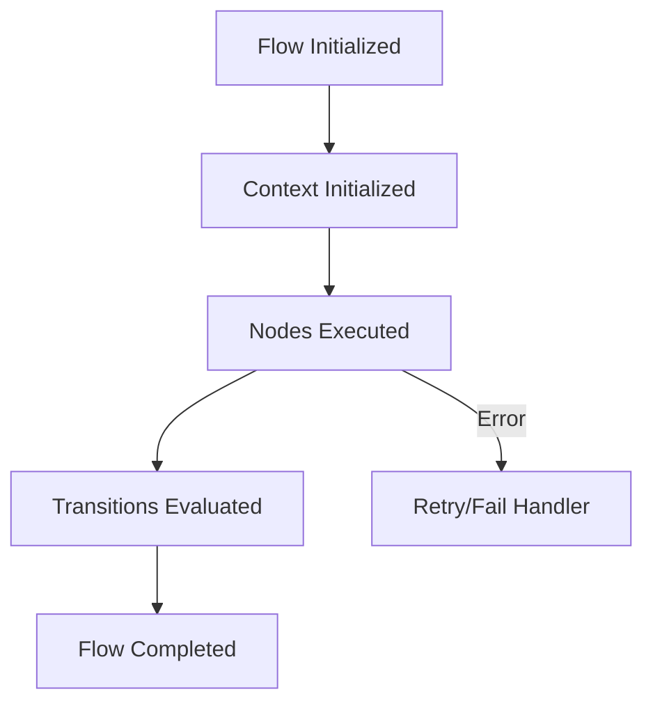

# ai-agent-flow

[](https://EunixTech.github.io/ai-agent-flow)

**ai-agent-flow** is a TypeScript-based Node.js framework designed for building intelligent, modular, and observable workflows for AI agents. It helps you compose systems using simple, pluggable components with built-in AI capabilities.

---

## 🚀 Features

- 🔄 **Composable Node-based Flows**: Build AI workflows using LLM, decision, batch, and custom logic nodes
- 🧠 **AI-first Architecture**: Native OpenAI support with persistent prompt history
- 📱 **Multi-agent Messaging**: Event-driven agent communication via `MessageBus`
- 📊 **Built-in Observability**: Winston logging and Prometheus-compatible metrics
- 🔌 **Extensible Plugin System**: Add new nodes, providers, and context stores
- 🔐 **Typed and Robust**: Full TypeScript support with retries, error handling, and shared context

---

## 🛆 Installation

```bash
npm install ai-agent-flow
```

---

## 💡 How It Works

### 💡 Chatbot Example Flow (Click to expand)



- **Nodes**: Smallest executable units (call LLM, run logic)
- **Flows**: Connect nodes with action-based transitions
- **Context**: Shared memory between nodes with data, metadata, and history
- **Runner**: Executes flows and handles retries/errors
- **Agents**: Flows + state + messaging capabilities

### 🤖 Agent Messaging Flow



### 📦 Data Pipeline Processing



### ♻️ Retry Flow for Error Handling



### 🧬 Agent Lifecycle



---

## ✨ Philosophy

We built `ai-agent-flow` because:

- Most existing tools (LangChain, AutoGen) are too abstract or too complex for beginners
- Developers want to **see, control, and debug** each step in their flow
- We believe agents should be **modular, testable, and observable** — like LEGO blocks

`ai-agent-flow` gives you full control over how data flows, how AI responds, and how agents collaborate.

---

## 🧠 Quick Start Example

```ts
import { Flow, Runner } from './src/index';
import { ActionNode } from './src/nodes/action';

const context = { conversationHistory: [], data: {}, metadata: {} };

const hello = new ActionNode('hello', async () => 'Hello');
const world = new ActionNode('world', async () => 'World');

const flow = new Flow('greet')
  .addNode(hello)
  .addNode(world)
  .setStartNode('hello')
  .addTransition('hello', { action: 'default', to: 'world' });

await new Runner().runFlow(flow, context);
```

---

## 📖 Example Applications

### 🔮 Chatbot (`examples/chatbot.ts`)

```bash
npx ts-node examples/chatbot.ts
```

### 🤝 Multi-agent system (`examples/multi-agent.ts`)

```bash
npx ts-node examples/multi-agent.ts
```

### 🧪 Data pipeline (`examples/data-pipeline.ts`)

```bash
npx ts-node examples/data-pipeline.ts
```

---

## 📁 Project Structure

```
src/
├── nodes/        # Node types like ActionNode, LLMNode
├── stores/       # Redis or in-memory context stores
├── providers/    # LLM clients (OpenAI)
├── utils/        # Messaging utils
├── index.ts      # Core framework (Node, Flow, Runner)
examples/         # Use cases
```

---

## 🧪 Tests

```bash
npm test
```

✔️ 100% coverage on statements, functions, and types.  
✔️ Covers edge cases (invalid flows, retries, node failures).  
✔️ All nodes and message flows tested.

---

## 📖 Documentation

- 📘️ [View the Docs](https://EunixTech.github.io/ai-agent-flow)

```bash
npm run docs
open ./docs/index.html
```

---

## 🔐 Extending the Framework

- Add your own nodes by extending `Node`
- Plug in custom LLM providers (Anthropic, HuggingFace)
- Implement your own context stores (MongoDB, S3)
- Replace `MessageBus` with Redis Pub/Sub or NATS

---

## 📊 Observability

- ✅ Logging: via [Winston](https://github.com/winstonjs/winston)
- ✅ Metrics: via [prom-client](https://github.com/siimon/prom-client)
- ✅ Events: listen to `nodeExecuted`, `flowCompleted` on `Flow`

---

## 🚽 Roadmap

| Phase         | Features                                |
| ------------- | --------------------------------------- |
| ✅ Now        | Full engine + nodes + OpenAI + examples |
| 🕸️ Short-term | Anthropic support, CLI tool, Prometheus |
| 🧠 Mid-term   | Visual editor, plugin API, Redis bus    |
| 🚁️ Long-term | Distributed agents, LLM auto-routing    |

---

## 🛠️ Contributing

```bash
git clone https://github.com/EunixTech/ai-agent-flow
npm install
npm test
```

We welcome all contributions — bug fixes, new nodes, documentation, examples 🙌

---

## 📄 License

MIT © 2025 [Rajesh Dhiman](https://www.rajeshdhiman.in)

---

## 💬 Contact

Open issues or reach out here:  
👉 [https://www.rajeshdhiman.in/contact](https://www.rajeshdhiman.in/contact)

> "Build agent flows like LEGO blocks — simple, powerful, and easy to debug."
