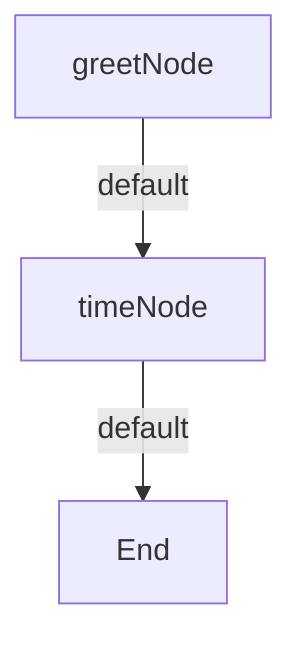

# ai-agent-flow

[](https://EunixTech.github.io/ai-agent-flow)

**ai-agent-flow** is a TypeScript-based Node.js framework designed for building intelligent, modular, and observable workflows for AI agents. It helps you compose systems using simple, pluggable components with built-in AI capabilities.

---

## 🚀 Features

- 🔄 **Composable Node-based Flows**: Build AI workflows using LLM, decision, batch, and custom logic nodes
- 🧠 **AI-first Architecture**: Native OpenAI support with persistent prompt history
- 📱 **Multi-agent Messaging**: Event-driven agent communication via `MessageBus`
- 📊 **Built-in Observability**: Winston logging and Prometheus-compatible metrics
- 🔌 **Extensible Plugin System**: Add new nodes, providers, and context stores
- 🔐 **Typed and Robust**: Full TypeScript support with retries, error handling, and shared context

---

## 🛆 Installation

```bash
npm install ai-agent-flow
```

---

## 💡 How It Works

### Core Concepts

1. **Nodes**: The smallest executable units in your workflow
   - `ActionNode`: Simple function-based nodes for quick tasks
   - `LLMNode`: AI model interactions (OpenAI, etc.)
   - Custom nodes: Extend the `Node` class for specific needs

2. **Flows**: Connect nodes with action-based transitions
3. **Context**: Shared memory between nodes
4. **Runner**: Executes flows with retry capabilities

### 🤖 Quick Start Example

```typescript
import { Flow, Runner, ActionNode } from 'ai-agent-flow';

// Create nodes
const greetNode = new ActionNode('greet', async () => 'Hello, World!');
const timeNode = new ActionNode('time', async () => new Date().toISOString());

// Create flow
const flow = new Flow('demo')
  .addNode(greetNode)
  .addNode(timeNode)
  .setStartNode('greet')
  .addTransition('greet', { action: 'default', to: 'time' });

// Run flow
const context = {
  conversationHistory: [],
  data: {},
  metadata: {}
};

const result = await new Runner().runFlow(flow, context);
console.log(result); // { type: 'success', output: '2024-03-20T...' }
```

### 📊 Flow Visualization



---

## 🧩 Core Components

### ActionNode

The `ActionNode` class provides a simple way to create nodes from async functions:

```typescript
// Simple action
const simpleNode = new ActionNode('simple', async () => 'result');

// With context
const contextNode = new ActionNode('withContext', async (context) => {
  const { data } = context;
  return `Processed ${data.item}`;
});

// With error handling
const safeNode = new ActionNode('safe', async () => {
  try {
    return await someOperation();
  } catch (error) {
    throw new Error('Operation failed');
  }
});
```

### Flow

The `Flow` class connects nodes and manages transitions:

```typescript
const flow = new Flow('myFlow')
  .addNode(nodeA)
  .addNode(nodeB)
  .setStartNode('nodeA')
  .addTransition('nodeA', { action: 'success', to: 'nodeB' });
```

### Runner

The `Runner` class executes flows with retry capabilities:

```typescript
const runner = new Runner(
  maxRetries = 3,    // Maximum retry attempts
  retryDelay = 1000  // Delay between retries (ms)
);

const result = await runner.runFlow(flow, context);
```

---

## 📊 Observability Example

```typescript
import { Flow, Runner, ActionNode } from 'ai-agent-flow';
import winston from 'winston';
import client from 'prom-client';

// Setup logging
const logger = winston.createLogger({
  level: 'info',
  format: winston.format.simple(),
  transports: [new winston.transports.Console()]
});

// Setup metrics
const register = new client.Registry();
const flowRunCounter = new client.Counter({
  name: 'flow_runs_total',
  help: 'Total number of flow runs'
});
register.registerMetric(flowRunCounter);

// Create observable node
const node = new ActionNode('observable', async () => {
  logger.info('Node executing...');
  flowRunCounter.inc();
  return 'Success!';
});

// Create and run flow
const flow = new Flow('observable-flow')
  .addNode(node)
  .setStartNode('observable');

const result = await new Runner().runFlow(flow, {
  conversationHistory: [],
  data: {},
  metadata: {}
});
```

---

## 📁 Project Structure

```
src/
├── nodes/        # Node implementations (ActionNode, LLMNode)
├── stores/       # Context storage implementations
├── providers/    # External service integrations
├── utils/        # Helper utilities
└── index.ts      # Core exports
```

---

## 🧪 Tests

```bash
npm test         # Run all tests
npm run coverage # Generate coverage report
```

---

## 📖 Documentation

### API Documentation

- [Nodes API](./docs/api/nodes.md) - Learn about the Node system and ActionNode
- [Flow API](./docs/api/flow.md) - Understand Flow creation and management
- [Runner API](./docs/api/runner.md) - Explore Flow execution and monitoring
- [Complete API Reference](./docs/api/index.md) - Full API documentation

### Examples

Check out our [examples directory](./examples) for complete working examples:
- Basic flows
- Error handling
- Data processing
- API integration
- Multi-step workflows

Generate docs locally:
```bash
npm run docs
```

---

## 🔐 Extending

### Custom Node Example

```typescript
import { Node, Context, NodeResult } from 'ai-agent-flow';

export class CustomNode extends Node {
  constructor(id: string) {
    super(id);
  }

  async execute(context: Context): Promise<NodeResult> {
    try {
      // Your custom logic here
      return {
        type: 'success',
        output: 'result'
      };
    } catch (error) {
      return {
        type: 'error',
        error: error instanceof Error ? error : new Error(String(error))
      };
    }
  }
}
```

---

## 🚽 Roadmap

| Phase         | Features                                |
| ------------- | --------------------------------------- |
| ✅ Now        | Core engine, ActionNode, observability  |
| 🕸️ Short-term | LLMNode, CLI tool, more examples       |
| 🧠 Mid-term   | Visual editor, plugin system            |
| 🚁️ Long-term | Distributed agents, auto-routing        |

---

## 🛠️ Contributing

```bash
git clone https://github.com/EunixTech/ai-agent-flow
npm install
npm test
```

We welcome all contributions — bug fixes, new nodes, documentation, examples 🙌

---

## 📄 License

MIT © 2025 [Rajesh Dhiman](https://www.rajeshdhiman.in)

---

## 💬 Contact

Open issues or reach out here:  
👉 [https://www.rajeshdhiman.in/contact](https://www.rajeshdhiman.in/contact)

> "Build agent flows like LEGO blocks — simple, powerful, and easy to debug."  
 
