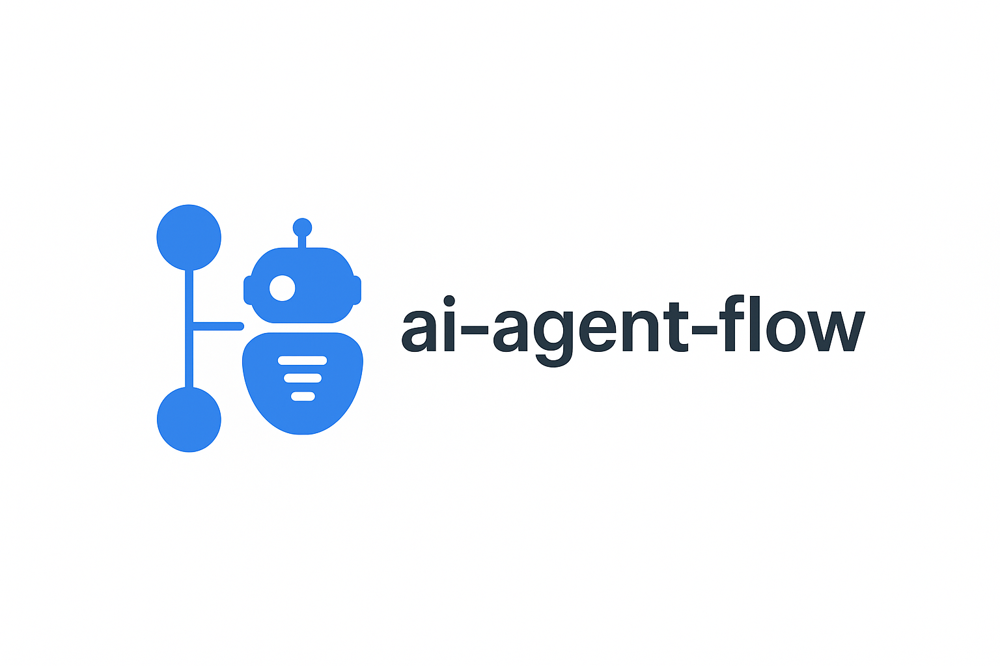
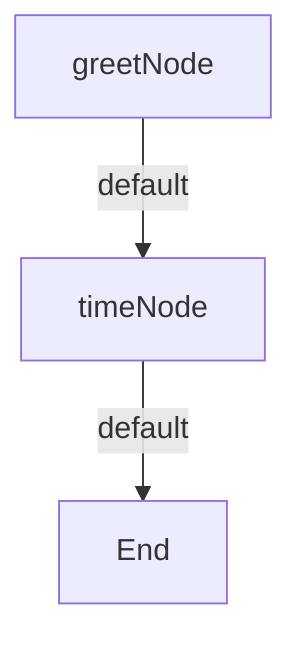

# ai-agent-flow

<div align="center">
  
  <p><em>A TypeScript framework for building intelligent, modular, and observable AI agent workflows</em></p>
</div>

[](https://EunixTech.github.io/ai-agent-flow)
[](https://www.npmjs.com/package/ai-agent-flow)
[](https://opensource.org/licenses/MIT)

**ai-agent-flow** is a TypeScript-based Node.js framework designed for building intelligent, modular, and observable workflows for AI agents. It helps you compose systems using simple, pluggable components with built-in AI capabilities.

---

## 🚀 Features

- 🔄 **Composable Node-based Flows**: Build AI workflows using LLM, decision, batch, and custom logic nodes
- 🧠 **AI-first Architecture**: Native OpenAI support with persistent prompt history
- 📱 **Multi-agent Messaging**: Event-driven agent communication via `MessageBus`
- 📊 **Built-in Observability**: Winston logging and Prometheus-compatible metrics
- 🔌 **Extensible Plugin System**: Add new nodes, providers, and context stores
- 🔐 **Typed and Robust**: Full TypeScript support with retries, error handling, and shared context

---

## 🛆 Installation

```bash
npm install ai-agent-flow
```

---

## 💡 How It Works

### Core Concepts

1. **Nodes**: The smallest executable units in your workflow

   - `ActionNode`: Simple function-based nodes for quick tasks
   - `LLMNode`: AI model interactions (OpenAI, etc.)
   - Custom nodes: Extend the `Node` class for specific needs

2. **Flows**: Connect nodes with action-based transitions
3. **Context**: Shared memory between nodes
4. **Runner**: Executes flows with retry capabilities

### 🤖 Quick Start Example

```typescript
import { Flow, Runner } from 'ai-agent-flow';
import { ActionNode } from 'ai-agent-flow/nodes/action';

// Create nodes
const greetNode = new ActionNode('greet', async () => 'Hello, World!');
const timeNode = new ActionNode('time', async () => new Date().toISOString());

// Create flow
const flow = new Flow('demo')
  .addNode(greetNode)
  .addNode(timeNode)
  .setStartNode('greet')
  .addTransition('greet', { action: 'default', to: 'time' });

// Run flow
const context = {
  conversationHistory: [],
  data: {},
  metadata: {},
};

const result = await new Runner().runFlow(flow, context);
console.log(result); // { type: 'success', output: '2024-03-20T...' }
```

### 📊 Flow Visualization



---

## 🧩 Core Components

### ActionNode

The `ActionNode` class provides a simple way to create nodes from async functions:

```typescript
import { ActionNode } from 'ai-agent-flow/nodes/action';

// Simple action
const simpleNode = new ActionNode('simple', async () => 'result');

// With context
const contextNode = new ActionNode('withContext', async (context) => {
  const { data } = context;
  return `Processed ${data.item}`;
});

// With error handling
const safeNode = new ActionNode('safe', async () => {
  try {
    return await someOperation();
  } catch (error) {
    throw new Error('Operation failed');
  }
});
```

### LLMNode

The `LLMNode` class provides AI model interactions:

```typescript
import { LLMNode } from 'ai-agent-flow/nodes/llm';

const chatNode = new LLMNode('chat', {
  model: 'gpt-3.5-turbo',
  messages: (context) => [
    { role: 'system', content: 'You are a helpful assistant.' },
    { role: 'user', content: context.data.userInput },
  ],
});
```

### BatchNode

The `BatchNode` class processes multiple items in parallel:

```typescript
import { BatchNode } from 'ai-agent-flow/nodes/batch';

const processItemsNode = new BatchNode('process-items', async (items, context) => {
  const results = await Promise.all(
    items.map(async (item) => {
      return { type: 'success', output: `Processed ${item}` };
    }),
  );
  return { type: 'success', output: results };
});
```

### DecisionNode

The `DecisionNode` class makes decisions based on context:

```typescript
import { DecisionNode } from 'ai-agent-flow/nodes/decision';

const decideNode = new DecisionNode('decide', async (context) => {
  if (context.data.shouldContinue) {
    return { type: 'success', action: 'continue' };
  }
  return { type: 'success', action: 'stop' };
});
```

### MessageBus

The `MessageBus` enables event-driven communication between agents. It allows agents to send and subscribe to messages asynchronously.

#### Example Usage

```typescript
import { MessageBus } from 'ai-agent-flow/utils/message-bus';

// Create a new MessageBus instance
const bus = new MessageBus();

// Subscribe agentB to receive messages
bus.subscribe('agentB', (senderId, message) => {
  console.log(`${senderId} says: ${message}`);
});

// Send a message from agentA to agentB
bus.send('agentA', 'agentB', 'Hello');

// Output: agentA says: Hello

```

This is particularly useful for multi-agent systems where agents need to communicate asynchronously.

---

## 📚 Documentation

For detailed documentation, visit our [API Documentation](https://EunixTech.github.io/ai-agent-flow).

### Importing Components

The framework uses a modular architecture with subpath exports for better code organization and tree-shaking:

```typescript
// Core components
import { Flow, Runner } from 'ai-agent-flow';

// Node types
import { ActionNode } from 'ai-agent-flow/nodes/action';
import { BatchNode } from 'ai-agent-flow/nodes/batch';
import { DecisionNode } from 'ai-agent-flow/nodes/decision';
import { LLMNode } from 'ai-agent-flow/nodes/llm';

// Types
import { Context, NodeResult, Transition } from 'ai-agent-flow/types';
```

### TypeScript Configuration

To use the subpath imports, make sure your `tsconfig.json` includes:

```json
{
  "compilerOptions": {
    "module": "NodeNext",
    "moduleResolution": "NodeNext"
  }
}
```

---

## 🤝 Contributing

Contributions are welcome! Please read our [Contributing Guide](CONTRIBUTING.md) for details on our code of conduct and the process for submitting pull requests.

---

## 📄 License

This project is licensed under the MIT License - see the [LICENSE](LICENSE) file for details.

---

## 🧪 Tests

```bash
npm test         # Run all tests
npm run coverage # Generate coverage report
```

---

## 📖 Documentation

### API Documentation

- [Nodes API](./docs/api/nodes.md) - Learn about the Node system and ActionNode
- [Flow API](./docs/api/flow.md) - Understand Flow creation and management
- [Runner API](./docs/api/runner.md) - Explore Flow execution and monitoring
- [Complete API Reference](./docs/api/index.md) - Full API documentation

### Examples

Check out our [examples directory](./examples) for complete working examples:

- Basic flows
- Error handling
- Data processing
- API integration
- Multi-step workflows

Generate docs locally:

```bash
npm run docs
```

### CLI Usage

Run a flow module directly from the command line:

```bash
npx aaflow run path/to/flow.ts
```

The module should export a `flow` instance (and optionally a `context` object):

```typescript
// flow.ts
import { Flow, ActionNode } from 'ai-agent-flow';

export const flow = new Flow('hello')
  .addNode(new ActionNode('hello', async () => 'Hi'))
  .setStartNode('hello');

export const context = {
  conversationHistory: [],
  data: {},
  metadata: {},
};
```

Then run:

```bash
npx aaflow run ./flow.ts
```

---

## 🔐 Extending

### Custom Node Example

```typescript
import { Node, Context, NodeResult } from 'ai-agent-flow';

export class CustomNode extends Node {
  constructor(id: string) {
    super(id);
  }

  async execute(context: Context): Promise<NodeResult> {
    try {
      // Your custom logic here
      return {
        type: 'success',
        output: 'result',
      };
    } catch (error) {
      return {
        type: 'error',
        error: error instanceof Error ? error : new Error(String(error)),
      };
    }
  }
}
```

---

## 🚽 Roadmap

| Phase         | Features                               |
| ------------- | -------------------------------------- |
| ✅ Now        | Core engine, ActionNode, observability |
| 🕸️ Short-term | LLMNode, CLI tool, more examples       |
| 🧠 Mid-term   | Visual editor, plugin system           |
| 🚁️ Long-term | Distributed agents, auto-routing       |

---

## 🛠️ Contributing

```bash
git clone https://github.com/EunixTech/ai-agent-flow
npm install
npm test
```

We welcome all contributions — bug fixes, new nodes, documentation, examples 🙌

---

## 📄 License

MIT © 2025 [Rajesh Dhiman](https://www.rajeshdhiman.in)

---

## 💬 Contact

Open issues or reach out here:  
👉 [https://www.rajeshdhiman.in/contact](https://www.rajeshdhiman.in/contact)

> "Build agent flows like LEGO blocks — simple, powerful, and easy to debug."
