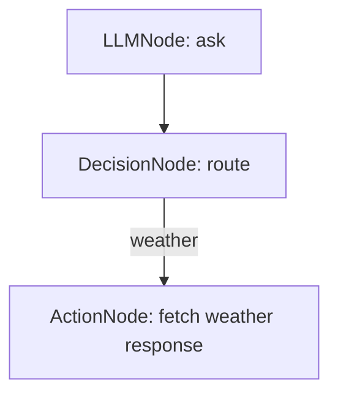
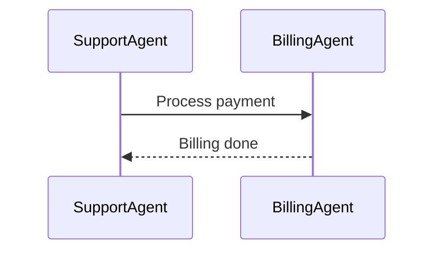
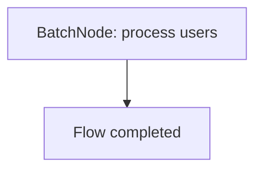

# 📚 Examples: Using ai-agent-flow

This document walks through the example applications included in `ai-agent-flow` and explains their structure, purpose, and key features.

---

## 🤖 1. Chatbot Example

**File:** `examples/chatbot.ts`

A simple conversational flow powered by OpenAI.

### 🧱 Node Flow Structure:



Example usage:

```typescript
const llmNode = new LLMNode('ask', {
  messages: (ctx) => [
    { role: 'user', content: ctx.data.userQuestion },
  ],
});
```

The `model` option defaults to `"gpt-3.5-turbo"`.

### 💡 What it does:

- Accepts a question from user (e.g., "What’s the weather today?")
- Sends prompt to OpenAI via `LLMNode`
- Uses `DecisionNode` to route to the weather handler if keyword matches
- Returns a static message (mock weather) from `ActionNode`

### ✨ Key Features:

- Shows how to build a dynamic, AI-powered decision flow
- Demonstrates prompt templating and conversation history
- Easy to customize for other intents

---

## 🤝 2. Multi-Agent System Example

**File:** `examples/multi-agent.ts`

Two agents communicating asynchronously via `MessageBus`.

### 🧱 Agent Structure:



### 💡 What it does:

- Simulates a support agent triggering a billing task
- Billing agent receives the message and sends a response back

### ✨ Key Features:

- Demonstrates use of `MessageBus` for agent messaging
- Great pattern for modular agent systems (customer support, finance, etc.)

---

## 📊 3. Data Pipeline (BatchNode) Example

**File:** `examples/data-pipeline.ts`

Batch-processes an array of users and evaluates their eligibility.

### 🧱 Flow Structure:



### 💡 What it does:

- Reads users from context (`data.users`)
- For each user, checks if `age >= 25`
- Appends an `eligible` flag to each
- Stores output in context or prints directly

### ✨ Key Features:

- Showcases how to run flows in parallel (via `Promise.all`)
- Simple ETL pattern: extract → transform → output
- Useful for lead scoring, job eligibility, segmentation, etc.

---

## 🛠 Tips for Customization

You can modify any example to:

- Use real API calls in `ActionNode`
- Replace mock decision logic with ML classifiers
- Add more `LLMNode` or `DecisionNode` for richer branching
- Persist flow state to Redis using `ContextStore`

---

## 📁 To Run Examples:

```bash
npx ts-node examples/chatbot.ts
npx ts-node examples/multi-agent.ts
npx ts-node examples/data-pipeline.ts
```

✅ Use `.env` for API keys
✅ Wrap top-level await with async IIFE

---

## 🔗 Want More?

- Add a custom node? Extend the `Node` class.
 - Run multi-flows? Use `Runner.runAgentFlows()` to execute several flows and get a map of results.
- Make it stateful? Use `RedisStore` for persistence.

We’d love to see what flows you build! 🚀
